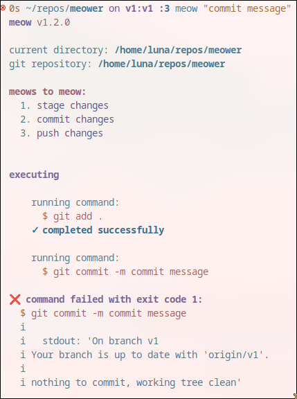

# meow v1
a git wrapper made in python  

## installation
this is currently only for linux and macos m1.  

run this to install the latest release: (untested for now)
```
curl -fsSL "https://raw.githubusercontent.com/ellipticobj/meower/refs/heads/v1/gitinstall.sh" | bash
```

or

use pip:
```
pip install meower
```

or 

download the latest file from [github releases](https://github.com/ellipticobj/meower/releases/latest)

## usage:
run `meow` to get detailed help

## building/installing locally
anyone can do this!  

in the cloned repository, 

download dependencies:
```
pip install -r requirements.txt
```

build:
```
./build.sh
```

# screenshots


# roadmap
- feature improvements (ask for user input for certain errors like no email detected)     